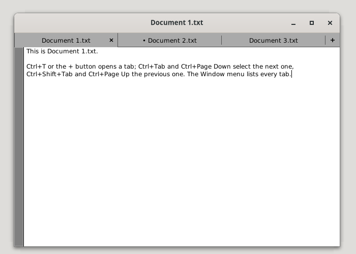
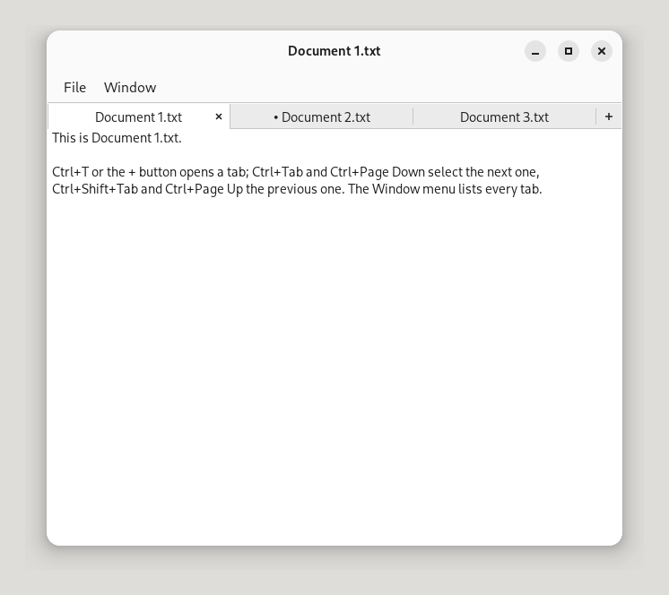

# gnustep-window-tabbing

Window tabs for GNUstep: Apple's `NSWindow` tabbing API, implemented
once, drawn by each theme. The plan and the spec are in
[#1](https://github.com/danjboyd/gnustep-window-tabbing/issues/1);
decisions are recorded there and below.

| GNUstep's theme | Adwaita (the default drawing, before #63) |
|---|---|
|  |  |

Apps use only Apple's API: on macOS they get native tabs, on GNUstep the
theme's (or this code's default drawing), and under a theme without this
code each document is its own window. Later this code moves into
libs-gui's `NSWindow` and `GSTheme`; themes then keep only their drawing.

## For a theme

Compile the sources in and call the installer once:

```make
GSWINDOWTABBING_DIR = path/to/gnustep-window-tabbing
include $(GSWINDOWTABBING_DIR)/GSWindowTabbing.make
MyTheme_OBJC_FILES += $(GSWINDOWTABBING_OBJC_FILES)
ADDITIONAL_INCLUDE_DIRS += $(GSWINDOWTABBING_INCLUDE_DIRS)
```

Two things the build needs:

- `GSWINDOWTABBING_DIR` must be a **relative** path (from the directory of
  the GNUmakefile): gnustep-make puts each object at
  `./obj/<target>.obj/<the source's path>`, which fails for an absolute
  path.
- The `+=` lines must come **before** `bundle.make` (or `application.make`,
  `library.make`) is included, after `common.make`: gnustep-make reads the
  file lists when it includes those, and later additions are never built.

```objc
#import "GSWindowTabbing.h"

- (id) initWithBundle: (NSBundle *)bundle
{
  GSWindowTabbingInstall ();
  return [super initWithBundle: bundle];
}
```

Install it before `[super initWithBundle:]`: GSTheme's `-initWithBundle:`
records the methods a theme overrides (`_overrideNSWindowMethod_...`)
with the implementations they replace, and an override then calls the
tabbing code's hook as its original. Installed later (in `-activate`),
a theme override of `-orderWindow:relativeTo:`, `-sendEvent:` or the
others skips the hook: windows don't join tabs, and the shortcuts don't
work.

`GSWindowTabbingInstall()` adds what `NSWindow` and `GSTheme` don't
have: the API, the hooks it needs, and GSTheme's default drawing. If
`NSWindow` already has `-addTabbedWindow:ordered:` (libs-gui with native
tabs, or another copy of this code) it does nothing and returns `NO`.
Compiled against a libs-gui that defines `GS_HAS_WINDOW_TABBING`, this
code declares and installs nothing at all.

An app can compile it in the same way (as `Examples/TabDemo` does), to
have tabs under any theme; call `GSWindowTabbingInstall()` after
`[NSApplication sharedApplication]`.

When an app and its theme both build it in, the runtime keeps one copy of
each class (libobjc2 warns "Loading two versions of ..."). The copy whose
classes were kept does the work, and the other hands its public functions
to it, so the two can be different commits as long as the classes'
interfaces match; the same commit is safest.

### The theme's methods

GSTheme has a plain default for each, in system colours; a theme
overrides what it draws differently. Each gets the tab bar's window.

```objc
- (CGFloat) windowTabBarHeightForWindow: (NSWindow *)window;          /* 28 */
- (GSWindowTabBarPlacement) windowTabBarPlacementForWindow: (NSWindow *)window;
- (CGFloat) windowTabMinimumWidthForWindow: (NSWindow *)window;       /* 80 */
- (CGFloat) windowTabMaximumWidthForWindow: (NSWindow *)window;       /* 240 */
- (CGFloat) windowTabNewTabButtonWidthForWindow: (NSWindow *)window;  /* 28; 0 for none */
- (CGFloat) windowTabBarMarginForWindow: (NSWindow *)window;          /* 0 */
- (CGFloat) windowTabSpacingForWindow: (NSWindow *)window;            /* 0 */
- (NSRect) windowTabCloseButtonRectForTabRect: (NSRect)tabRect
                                        state: (GSWindowTabState)state
                                       window: (NSWindow *)window;
- (void) drawWindowTabBarBackgroundInRect: (NSRect)rect
                                   window: (NSWindow *)window;
- (void) drawWindowTab: (NSWindowTab *)tab
                inRect: (NSRect)rect
                 state: (GSWindowTabState)state
                window: (NSWindow *)window;
- (void) drawWindowTabCloseButtonInRect: (NSRect)rect
                                  state: (GSWindowTabState)state
                                 window: (NSWindow *)window;
- (void) drawWindowTabNewTabButtonInRect: (NSRect)rect
                                   state: (GSWindowTabState)state
                                  window: (NSWindow *)window;
- (CGFloat) windowTabBarScrollFadeWidthForWindow: (NSWindow *)window; /* 24; 0 for none */
- (void) drawWindowTabBarScrollFadeInRect: (NSRect)rect
                                     edge: (NSRectEdge)edge
                                   window: (NSWindow *)window;
```

- **States:** `GSWindowTabState` is a set of bits (selected, hovered,
  pressed, key window, close button hovered or pressed, edited, first,
  last). `GSWindowTabPreviousHighlighted` says the tab before is
  selected, hovered or pressed, so a theme can leave out the separator
  between them.
- **Placement:** `GSWindowTabBarAboveContent` (the default) gives the bar
  its own row directly above the content: below a title or header bar, an
  in-window menu bar and a toolbar. The content gives up the row while the
  bar shows and takes it back when it hides; the window keeps its frame.
  `GSWindowTabBarInTitleBar` reserves nothing: the theme's window
  decoration places the bar itself, asking for its view with
  `GSWindowTabBarViewForWindow()` and listening for
  `GSWindowTabBarDidChangeNotification` (object: the window).
- **State** (`GSWindowTabState`, bits): `GSWindowTabSelected`, `Hovered`,
  `Pressed`, `WindowKey` (the bar's window is key), `CloseHovered`,
  `ClosePressed`, `Edited` (the tab's window has unsaved changes), `First`,
  `Last`, `Dragged` (the tab the pointer is moving: drawn last, over the
  others, at the pointer). The "+" button gets `Hovered`, `Pressed` and
  `WindowKey`.
- **Widths:** tabs share the bar's width equally, between the minimum and
  the maximum, from the bar's start: the width less the margin at each
  end, the "+" button, and the spacing between tabs and before the "+".
  Past the minimum, the tabs scroll inside their area, clipped to it.
  The tab rects passed to the theme are full height; a theme insets its
  drawing vertically itself.
- **Close button:** `-windowTabCloseButtonRectForTabRect:state:window:`
  returns its rect in the tab, or `NSZeroRect` for none in that state (the
  default shows it on the selected tab and the one under the pointer). Hit
  testing uses the same rect.
- **Titles:** `-drawWindowTab:…` draws the title; `GSWindowTabFittedTitle()`
  shortens one with an ellipsis to fit a width.
- **Scroll fades:** at an end of the tabs' area where tabs are scrolled
  out of sight, the bar asks for `-drawWindowTabBarScrollFadeInRect:…`,
  over the tabs, in a rect as wide as
  `-windowTabBarScrollFadeWidthForWindow:` at that edge (`NSMinXEdge`
  or `NSMaxXEdge`). The default fades `controlColor` in towards the edge.
- **Drops from another window:** while a tab pulled out of one window is
  over another's bar, that bar opens an empty slot where it would drop;
  the theme draws nothing for it (as AdwTabBox's placeholder, which the
  drag icon covers).

## For an app: the API

Apple's names and behaviour, a subset:

- `NSWindow`: `tabbingMode`, `tabbingIdentifier`,
  `+allowsAutomaticWindowTabbing` / `+setAllowsAutomaticWindowTabbing:`,
  `+userTabbingPreference`, `-addTabbedWindow:ordered:`, `tabbedWindows`
  (nil unless in a group with others), `tab`, `tabGroup`, and the actions
  `-selectNextTab:`, `-selectPreviousTab:`, `-moveTabToNewWindow:`,
  `-mergeAllWindows:`, `-toggleTabBar:`, validated in
  `-validateUserInterfaceItem:` (Toggle's menu item reads "Show Tab Bar" or
  "Hide Tab Bar").
- `NSWindowTab`: `title` (the window's title unless set; it follows
  `-setTitle:` and `-setTitleWithRepresentedFilename:`; for a window whose
  title is GNUstep's represented-filename title, "Notes.txt  --  /tmp", the
  file's name alone, as macOS shows it), `attributedTitle`,
  `toolTip` (shown over the tab), `accessoryView` (stored, not shown yet).
- `NSWindowTabGroup`: `identifier`, `windows`, `selectedWindow` (settable),
  `tabBarVisible`, `overviewVisible` (always NO), `-addWindow:`,
  `-insertWindow:atIndex:`, `-removeWindow:`.
- `-newWindowForTab:` is sent along the responder chain by the bar's "+"
  button, shown only when something responds; the window the responder
  orders in for the first time joins the asking window's group.

Behaviour:

- Only a group's selected window is on screen; the others are ordered out
  and stay in the group. Selecting a tab gives its window the old one's
  frame and key status, so moving and resizing act on the group.
- A window added with `-addTabbedWindow:ordered:` or
  `-insertWindow:atIndex:` becomes the selected tab. `NSWindowAbove` puts
  it right after the receiver's tab, `NSWindowBelow` right before.
- Ordering a hidden tab in (the Windows menu, `-makeKeyAndOrderFront:`)
  selects it. The Windows menu lists every tab: GNUstep keeps hidden
  windows there until they close.
- Closing the selected tab selects its right-hand neighbour (the one
  before it for the last tab); closing the last window ends the group.
  The neighbour is shown before the window closes (in `-close`), so the app
  never counts the closed tab as its last window: NSApplication decides
  that at `NSWindowWillCloseNotification`, from the windows on screen, and
  an app whose delegate says to terminate after the last window would
  quit.
- The bar hides with one window, unless `-toggleTabBar:` showed it;
  toggling back to what the automatic rule would show returns to it.
- Automatic tabbing: a window with `NSWindowTabbingModePreferred` (or
  `Automatic` when `+allowsAutomaticWindowTabbing` and the user's
  preference is "always") joins the key window's group when it is first
  ordered in, if their `tabbingIdentifier`s match. While the app isn't
  active, the key window falls back to the window that says it's key, the
  main window, then the frontmost window it can tab with.
  `+userTabbingPreference` reads `AppleWindowTabbingMode` (`always`,
  `manual`, `fullscreen`), as on macOS; the default, `fullscreen`, means
  manual here, as GNUstep has no full-screen spaces.
- `tabbingIdentifier` defaults to the window's class name.
- Only titled windows that aren't panels are tabbed, and never
  `NSWindowTabbingModeDisallowed` ones.
- Keyboard: Ctrl+Tab and Ctrl+Page Down select the next tab,
  Ctrl+Shift+Tab and Ctrl+Page Up the previous one, as in GNOME's apps,
  while the window has more than one tab. They are taken in the window's
  `-performKeyEquivalent:` (NSApp offers a key-down to the key window
  there first) and `-sendEvent:`, ahead of the first responder: a text
  view doesn't get them (it would insert a tab or scroll), and with one tab
  they go on as before (Ctrl+Tab moves between key views).
- Mouse: a press selects a tab (as GTK's tabs do); the close and "+"
  buttons act on the release; a middle click closes a tab.
- Dragging, as AdwTabBar: a tab moved past GTK's drag threshold (8
  points) follows the pointer along the bar while the others make room;
  on the release it takes that slot and stays selected; Escape puts it
  back. Held past an end of a bar whose tabs scroll, it scrolls the bar.
  Taken 32 points above or below the bar (four times the threshold, as
  AdwTabBox), it is pulled out: over the bar (or, with none, the top 48
  points) of a window with the same `tabbingIdentifier`, that bar opens a
  slot for it and the release makes it a tab there; anywhere else the
  release makes it a window of its own, placed under the pointer where it
  was pressed. The window appears on the release: GNUstep can't move a
  window smoothly under a dragging pointer, and nothing is drawn under
  the pointer while the tab is out of a bar. The drag is a tracking loop
  over the app's own windows, not GNUstep's drag and drop, so a tab moves
  only within its app.
- Scrolling: tabs that don't fit at their minimum width scroll with the
  wheel (either axis), a step being GTK's (the visible width to the power
  2/3); the selected tab is scrolled into sight when it changes.

Not yet: a drag image for a pulled-out tab, the tab overview,
`accessoryView` in the bar, accessibility. Miniaturizing and zooming act on the selected window,
which is the only one on screen.

## Inside

The code is laid out as it would sit in libs-gui, with one file that
exists only because it isn't there yet:

| File | Upstream |
|---|---|
| `Headers/AppKit/NSWindowTab.h`, `NSWindowTabGroup.h` | `Headers/AppKit/`, as they are |
| `Headers/GSWindowTabbing.h` | `NSWindow.h` (the API), `GSTheme.h` (the theme's methods) |
| `Source/NSWindowTabGroup.m`, `NSWindowTab.m` | `Source/`, as they are |
| `Source/GSWindowTabbingWindow.m` | `NSWindow.m`: its methods, as they are |
| `Source/GSWindowTabbingDecorationView.m` | `GSWindowDecorationView.m`: `-_layoutTabBar` |
| `Source/GSWindowTabBarView.m`, `GSWindowTabBarLayout.m` | `Source/GSWindowTabBarView.m` (one file) |
| `Source/GSWindowTabbingTheme.m` | a `GSTheme` category, as it is |
| `Source/GSWindowTabbingInstall.m` | nothing: deleted |

- **The model** (`NSWindowTabGroup`, `NSWindowTab`) sees its windows
  only through the `GSWindowTabbable` protocol
  (`Source/GSWindowTabbingPrivate.h`), so it is tested with stand-in
  windows. A group retains its windows only while it has two or more (the
  hidden ones need it); a window on its own isn't held.
- **The logic** is written as `NSWindow`, `GSWindowDecorationView` and
  `GSTheme` methods, in subclasses that are never instantiated
  (`GSWindowTabbingWindow` and the others): `GSWindowTabbingInstall()`
  copies their methods into the real classes where those have none, so
  `self` is always the real class, and none of them uses `super`.
  Upstream the subclass lines go, and the methods are pasted in.
- **The hook layer** (`GSWindowTabbingInstall.m`) is everything that is
  only needed from outside libs-gui:
  - each window's state, kept beside it in a map table (upstream:
    instance variables of `NSWindow`);
  - wrappers around `-orderWindow:relativeTo:`, `-setTitle:`,
    `-setTitleWithRepresentedFilename:`, `-setDocumentEdited:`,
    `-performKeyEquivalent:`, `-sendEvent:`, `-close`,
    `-validateUserInterfaceItem:` and `-dealloc`, and around
    `GSWindowDecorationView`'s `-layout`,
    `-contentRectForFrameRect:styleMask:` and
    `-frameRectForContentRect:styleMask:`. Each calls one private
    `-_tabbing...` method and then the original; its comment says the one
    line that goes into the real method upstream;
  - the check for two copies (an app's and its theme's).

## Building and testing

```sh
make                 # the library (for tests); themes use GSWindowTabbing.make
make check-model     # Tests/gui/NSWindowTabGroup: stand-in windows, no display
make check-display   # Tests/gui/NSWindow: real NSWindows; needs DISPLAY
make check           # both
make tabdemo         # Examples/TabDemo
Tests/Scripts/gcc-syntax-check.sh --files Source/*.m Tests/gui/*/*.m
```

The tests are in libs-gui's layout (`Tests/gui/<class>/`, `TestInfo`,
`Testing.h`, skipped without a display server), so upstream they go into
libs-gui's `Tests/gui/` as they are, the model test then linking the
model instead of compiling it in.

`check-display` should run with empty user defaults (a copy of
GNUstep.conf whose `GNUSTEP_USER_DEFAULTS_DIR` is an empty directory,
mode 0600, as `GNUSTEP_CONFIG_FILE`), and on a display of its own (a
private Xvfb is enough; no window manager is needed).

The code follows GNUstep's coding standards (libs-base's
`Documentation/coding-standards.texi`). It builds without warnings with
clang and libobjc2 and with GCC and GNU libobjc: on 2026-10-08, GCC
14.2 (Debian's `gobjc` and `libobjc-14-dev`) built tools-make, libs-base,
libs-gui and libs-back (cairo) master into a scratch prefix, with
gnustep-make configured `--with-library-combo=gnu-gnu-gnu
--enable-native-objc-exceptions` (libs-gui's `@synchronized` needs
native exceptions) and libs-base `--disable-libdispatch`; this library
then built with no warnings and passed `make check` (69 and 83 tests,
with dragging and scrolling).

## Licence and upstream

LGPL-2.1-or-later (`LICENSE`). Nothing from this repository goes to
GNUstep without Dan's sign-off on the exact hash, following
`Docs/UPSTREAM_POLICY.md` in plugins-themes-Adwaita. Whether libs-gui
needs an FSF copyright assignment for code of this size is open (see #1).

AI assistance: this code, its tests and its documentation were written
with Claude (Anthropic's Claude Code).
